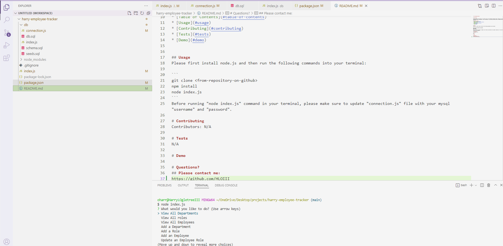

# harry-employee-tracker


## Description

The main purpose of this project is to provide a tool to track employees information within a company. This tool enables users to view and manage the departments, roles, and employees. It can be used by business owners for organizing and planning their businesses.

## Table of Contents
* [Description](#description)
* [Table of Contents](#table-of-contents)
* [Usage](#usage)
* [Contributing](#contributing)
* [Tests](#tests)
* [Demo](#demo)


## Usage
Please first install node.js and then run the following commands into your terminal: 

```
git clone <from-repository-on-github>
npm install
node index.js
```
Before running "node index.js" command in your terminal, please make sure to update "connection.js" file with your mysql "username" and "password".

# Contributing
​Contributors: N/A

# Tests
N/A

# Mockup Image


# Questions?
## Please contact me:
https://github.com/HLOIII
